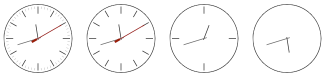

# Analogue and Digital Clocks as Web Components

[](http://badge.fury.io/js/web-clocks)
[](https://github.com/prantlf/web-clocks/actions)
[](https://david-dm.org/prantlf/web-clocks)
[](https://david-dm.org/prantlf/web-clocks#info=devDependencies)
[](https://www.webcomponents.org/element/web-clocks)

[Web components] showing an analogue clock known from [a Svelte example] and a digital clock similar to [another Svelte example].

<!--
```
<custom-element-demo>
  <template>
    <script type=module src=https://unpkg.com/web-clocks@0.0.1/dist/index.mjs></script>
    <ana-clock></ana-clock>
    <digi-clock></digi-clock>
  </template>
</custom-element-demo>
```
-->


See the [on-line demo] or the [storybook].

## Usage

1: Place the `ana-clock` or `digi-clock` web component with or without attributes to a page. For example:

```html
<ana-clock></ana-clock>
<ana-clock secondhand="false"></ana-clock>
<digi-clock></digi-clock>
<digi-clock seconds="false"></digi-clock>
```

2: Include the implementation of the web component on your page, typically at the bottom of the `body` element. Choose the way that fits your scenario the base.

```html
<!-- Load both clocks from the NPM CDN -->
<script type="module" src="https://unpkg.com/web-clocks@1.0.0/dist/index.mjs"></script>
```

```html
<!-- Load either analogue or digital clock from a local installation -->
<script type="module" src="node_modules/web-clocks/dist/ana-clock.mjs"></script>
<script type="module" src="node_modules/web-clocks/dist/digi-clock.mjs"></script>
```

```html
<script type="module">
  // Load both clocks and use their classes
  import { AnaClock, DigiClock } from '../dist/index.mjs'
  ...
</script>
```

```html
<script type="module">
  // Load either analogue or digital clock and use their classes
  import AnaClock from '../dist/ana-clock.mjs'
  import DigiClock from '../dist/digi-clock.mjs'
  ...
</script>
```

```js
// Include either analogue or digital clock in your application bundle
import { AnaClock, DigiClock } from 'web-clocks'
```

### Attributes

| Attribute    | Description                               | Values                                  | Default |
|--------------|-------------------------------------------|-----------------------------------------|---------|
| `markers`    | chooses the density of markers (analogue) | `sixty` \| `twelve` \| `four` \| `none` | `sixty` |
| `secondhand` | disables the second hand (analogue)       | boolean                                 | `true`  |
| `seconds`    | disables the second part (digital)        | boolean                                 | `false` |
| `offset`     | adds the offset in minutes to UTC         | number of minutes                       | `0`     |

### Methods

| Name        | Description                                                 |
|-------------|-------------------------------------------------------------|
| `stop()`    | stops the clock                                             |
| `restart()` | sets the clock to the current time and starts ticking again |

### Events

| Name   | Triggered                                | Details         |
|--------|------------------------------------------|-----------------|
| `tick` | when the second or the minute hand moves | current `Date`  |

## Contributing

In lieu of a formal styleguide, take care to maintain the existing coding style. Lint and test your code using `npm test`.

## License

Copyright (c) 2021-2023 Ferdinand Prantl

Licensed under the MIT license.

[a Svelte example]: https://svelte.dev/repl/clock?version=3.30.1
[another Svelte example]: https://svelte.dev/repl/a15e5bf484bf4eddafe68996d4235187?version=3.18.2
[Web components]: https://developer.mozilla.org/en-US/docs/Web/Web_Components
[on-line demo]: https://prantlf.github.io/web-clocks/
[storybook]: https://prantlf.github.io/web-clocks/storybook/
